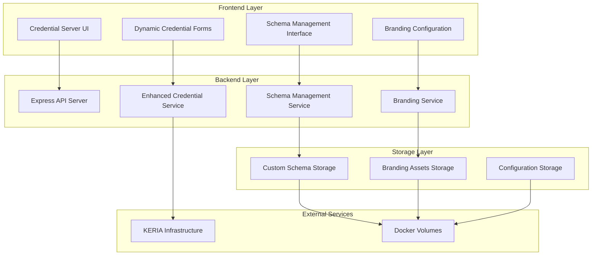

# Design Document

## Overview

The credential issuance customization feature will extend the existing credential server and UI to support organization-specific branding, dynamic schema management, and enhanced credential generation capabilities. The system currently uses a Node.js/Express backend with a React/TypeScript frontend, both containerized with Docker and integrated with the KERIA infrastructure for cryptographic operations.

The design maintains backward compatibility with existing functionality while adding new customization layers that can be configured through environment variables, configuration files, and a new schema management interface.

## Architecture

### Current System Architecture
- **Backend**: Node.js/Express server with SignifyClient integration
- **Frontend**: React/TypeScript SPA with Material-UI components
- **Storage**: File-based schema storage with KERIA integration
- **Deployment**: Docker containers with Traefik reverse proxy

### Enhanced Architecture Components



## Components and Interfaces

### 1. Branding Management System

#### Backend Components
- **BrandingService**: Manages organization branding configuration
- **BrandingAPI**: REST endpoints for branding operations
- **AssetManager**: Handles logo and asset file operations

#### Frontend Components
- **BrandingProvider**: React context for branding state
- **LogoComponent**: Dynamic logo display component
- **BrandingSettings**: Admin interface for branding configuration

#### Configuration Structure
```typescript
interface BrandingConfig {
  organizationName: string;
  logoUrl?: string;
  primaryColor?: string;
  secondaryColor?: string;
  favicon?: string;
  customCSS?: string;
}
```

### 2. Dynamic Schema Management System

#### Backend Components
- **SchemaService**: Enhanced schema CRUD operations
- **SchemaValidator**: JSON schema validation service
- **SchemaVersioning**: Schema version management
- **SchemaAPI**: REST endpoints for schema operations

#### Frontend Components
- **SchemaEditor**: Visual schema creation interface
- **SchemaList**: Schema management dashboard
- **FieldBuilder**: Dynamic form field configuration
- **SchemaPreview**: Schema validation and preview

#### Schema Structure
```typescript
interface CustomSchema {
  id: string;
  name: string;
  version: string;
  description?: string;
  fields: SchemaField[];
  metadata: SchemaMetadata;
  createdAt: Date;
  updatedAt: Date;
}

interface SchemaField {
  name: string;
  type: 'string' | 'number' | 'boolean' | 'date' | 'email' | 'url';
  required: boolean;
  validation?: ValidationRule[];
  displayName: string;
  description?: string;
  defaultValue?: any;
}
```

### 3. Enhanced Credential Generation System

#### Backend Components
- **DynamicCredentialService**: Generates credentials from custom schemas
- **CredentialValidator**: Validates credential data against schemas
- **AuditLogger**: Logs all credential operations

#### Frontend Components
- **DynamicCredentialForm**: Generates forms from schema definitions
- **CredentialPreview**: Shows credential before issuance
- **BulkCredentialUpload**: CSV/Excel import for batch generation

### 4. Configuration Management System

#### Environment Variables
```bash
# Branding Configuration
CUSTOM_ORG_NAME=My Organization
CUSTOM_LOGO_PATH=/app/assets/logo.png
CUSTOM_PRIMARY_COLOR=#1976d2
CUSTOM_SECONDARY_COLOR=#dc004e

# Schema Configuration
CUSTOM_SCHEMAS_PATH=/app/data/schemas
ENABLE_SCHEMA_MANAGEMENT=true
SCHEMA_VALIDATION_STRICT=true

# Feature Flags
ENABLE_BRANDING_CUSTOMIZATION=true
ENABLE_BULK_CREDENTIAL_GENERATION=true
```

## Data Models

### Enhanced Schema Storage
```typescript
// Extends existing ACDC_SCHEMAS structure
interface EnhancedSchemaRegistry {
  defaultSchemas: SchemaDefinition[];
  customSchemas: CustomSchema[];
  schemaVersions: Map<string, SchemaVersion[]>;
}

interface SchemaDefinition {
  id: string;
  name: string;
  type: 'default' | 'custom';
  schema: JSONSchema;
  uiSchema?: UISchema;
  isActive: boolean;
}
```

### Credential Generation Data
```typescript
interface CredentialGenerationRequest {
  schemaId: string;
  recipientAid: string;
  credentialData: Record<string, any>;
  metadata?: CredentialMetadata;
  brandingOverrides?: Partial<BrandingConfig>;
}

interface CredentialMetadata {
  issuerName: string;
  issuanceDate: Date;
  expirationDate?: Date;
  credentialType: string;
  customFields?: Record<string, any>;
}
```

### Branding Asset Management
```typescript
interface BrandingAsset {
  id: string;
  type: 'logo' | 'favicon' | 'background' | 'css';
  filename: string;
  path: string;
  mimeType: string;
  size: number;
  uploadedAt: Date;
}
```

## Error Handling

### Schema Validation Errors
- **Invalid Schema Structure**: Return detailed validation errors with field-level feedback
- **Schema Version Conflicts**: Handle version mismatches with clear resolution paths
- **Missing Required Fields**: Provide specific field validation messages

### Branding Configuration Errors
- **Invalid Asset Formats**: Validate image formats and sizes
- **Missing Assets**: Fallback to default branding gracefully
- **Configuration Conflicts**: Resolve conflicts with precedence rules

### Credential Generation Errors
- **Schema Mismatch**: Validate data against schema before generation
- **KERIA Integration Failures**: Implement retry logic and error reporting
- **Audit Trail Failures**: Ensure credential operations are logged even on partial failures

### Error Response Format
```typescript
interface ErrorResponse {
  success: false;
  error: {
    code: string;
    message: string;
    details?: Record<string, any>;
    field?: string; // For field-specific validation errors
  };
  timestamp: Date;
}
```

## Testing Strategy

### Unit Testing
- **Schema Validation**: Test all schema validation rules and edge cases
- **Branding Service**: Test asset loading, fallbacks, and configuration merging
- **Credential Generation**: Test credential creation with various schema types
- **API Endpoints**: Test all new REST endpoints with various input scenarios

### Integration Testing
- **KERIA Integration**: Test credential issuance flow with custom schemas
- **Docker Integration**: Test volume mounting and environment variable handling
- **Database Operations**: Test schema persistence and retrieval operations

### End-to-End Testing
- **Complete Customization Flow**: Test full branding setup and schema creation
- **Credential Issuance Flow**: Test end-to-end credential generation with custom schemas
- **UI Workflow**: Test complete user journey from schema creation to credential issuance

### Performance Testing
- **Schema Loading**: Test performance with large numbers of custom schemas
- **Asset Loading**: Test branding asset loading performance
- **Bulk Operations**: Test bulk credential generation performance

### Security Testing
- **Input Validation**: Test all input validation and sanitization
- **File Upload Security**: Test asset upload security and validation
- **Access Control**: Test schema and branding management permissions

### Test Data Management
- **Schema Fixtures**: Create test schemas for various use cases
- **Branding Assets**: Prepare test assets in various formats
- **Credential Test Data**: Generate test data for different schema types

### Automated Testing Pipeline
- **Pre-commit Hooks**: Run linting and unit tests
- **CI/CD Integration**: Run full test suite on pull requests
- **Docker Testing**: Test containerized deployment scenarios