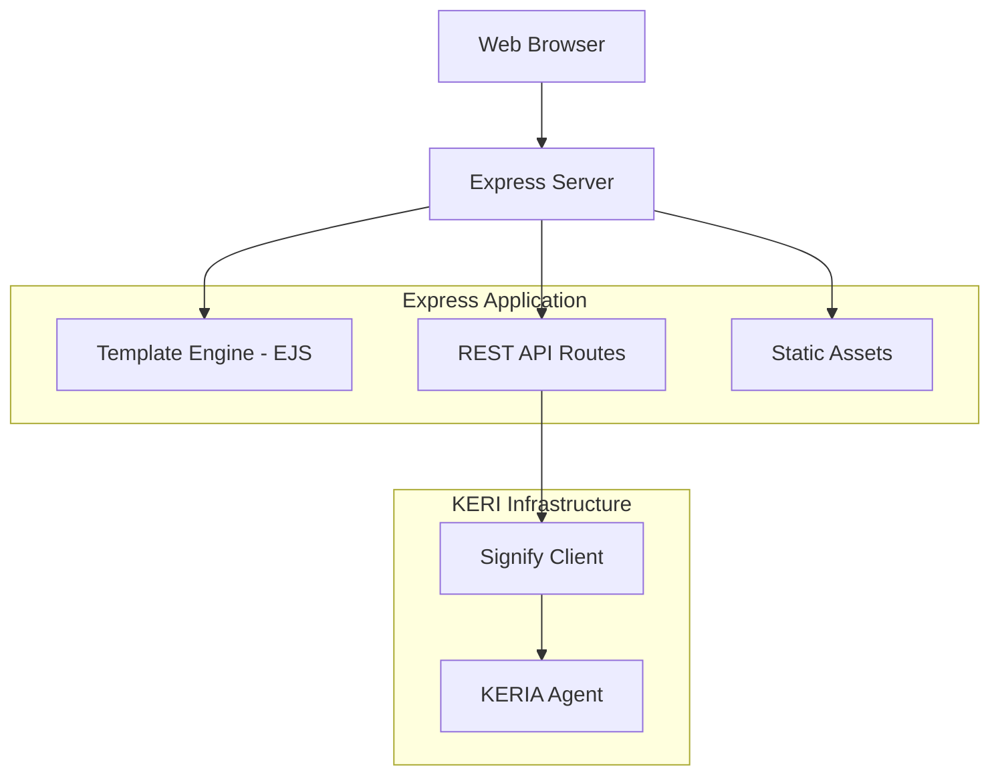

# Design Document

## Overview

The simplified credential server is a single Express.js application that combines both frontend and backend functionality for credential issuance. It uses a template engine (EJS) to serve HTML pages and provides REST APIs for credential operations. The system leverages the existing KERI/Signify infrastructure while providing a streamlined interface for credential issuance.

## Architecture

### High-Level Architecture



### Application Structure

```
services/simplified-credential-server/
├── src/
│   ├── server.ts              # Main server file
│   ├── config.ts              # Configuration
│   ├── routes/
│   │   ├── api.ts             # API routes
│   │   └── web.ts             # Web page routes
│   ├── controllers/
│   │   ├── invitation.ts      # Invitation logic
│   │   └── credential.ts      # Credential issuance logic
│   ├── utils/
│   │   └── keri.ts           # KERI/Signify utilities
│   └── views/
│       ├── layout.ejs         # Base template
│       ├── dashboard.ejs      # Main dashboard
│       └── partials/
│           ├── header.ejs
│           └── footer.ejs
├── public/
│   ├── css/
│   ├── js/
│   └── images/
└── package.json
```

## Components and Interfaces

### 1. Express Server (server.ts)
- **Purpose**: Main application entry point
- **Responsibilities**:
  - Initialize Express app with EJS template engine
  - Set up middleware (CORS, body parser, static files)
  - Initialize Signify clients
  - Configure routes
  - Start server

### 2. Configuration (config.ts)
- **Purpose**: Centralized configuration management
- **Interface**:
```typescript
interface Config {
  port: number;
  keria: {
    url: string;
    bootUrl: string;
  };
  oobiEndpoint: string;
  paths: {
    api: string;
    invitation: string;
    credential: string;
  };
}
```

### 3. Web Routes (routes/web.ts)
- **Purpose**: Serve HTML pages using EJS templates
- **Routes**:
  - `GET /` - Dashboard page
  - `GET /invitation` - Invitation generation page
  - `GET /credential` - Credential issuance page

### 4. API Routes (routes/api.ts)
- **Purpose**: REST API endpoints for credential operations
- **Routes**:
  - `GET /api/invitation` - Generate KERI OOBI invitation
  - `POST /api/credential` - Issue credential to recipient

### 5. Invitation Controller (controllers/invitation.ts)
- **Purpose**: Handle invitation generation logic
- **Interface**:
```typescript
interface InvitationResponse {
  success: boolean;
  data: {
    oobi: string;
    qrCode?: string;
  };
}
```

### 6. Credential Controller (controllers/credential.ts)
- **Purpose**: Handle credential issuance logic
- **Interface**:
```typescript
interface CredentialRequest {
  recipientId: string;
  schemaId: string;
  attributes: Record<string, any>;
}

interface CredentialResponse {
  success: boolean;
  data: string;
  credentialId?: string;
}
```

### 7. KERI Utilities (utils/keri.ts)
- **Purpose**: Wrapper functions for Signify client operations
- **Functions**:
  - `initializeSignifyClient()` - Initialize and connect client
  - `generateOOBI()` - Generate OOBI invitation
  - `issueCredential()` - Issue ACDC credential
  - `ensureIdentifier()` - Ensure identifier exists

## Data Models

### Invitation Data
```typescript
interface Invitation {
  oobi: string;           // OOBI URL for connection
  timestamp: string;      // Generation timestamp
  issuerName: string;     // Issuer identifier name
}
```

### Credential Data
```typescript
interface CredentialData {
  recipientId: string;    // Recipient AID
  schemaId: string;       // Schema SAID
  attributes: {           // Credential attributes
    [key: string]: any;
  };
  issuerName: string;     // Issuer identifier
}
```

### Configuration Data
```typescript
interface ServerConfig {
  port: number;
  keriaUrl: string;
  keriaBootUrl: string;
  oobiEndpoint: string;
  issuerName: string;
  qviName: string;
}
```

## Error Handling

### Error Types
1. **KERI Connection Errors**: Handle Signify client connection failures
2. **Credential Issuance Errors**: Handle schema validation and issuance failures
3. **Template Rendering Errors**: Handle EJS template errors
4. **Validation Errors**: Handle input validation failures

### Error Response Format
```typescript
interface ErrorResponse {
  success: false;
  error: {
    code: string;
    message: string;
    details?: any;
  };
}
```

### Error Handling Strategy
- Use Express error middleware for centralized error handling
- Log errors with appropriate severity levels
- Return user-friendly error messages in web interface
- Provide detailed error information in API responses


## Security Considerations

### Input Validation
- Validate all API inputs using schema validation
- Sanitize template inputs to prevent XSS
- Validate KERI identifiers and schemas

### Authentication & Authorization
- Basic authentication for web interface (optional)
- Rate limiting for API endpoints
- CORS configuration for cross-origin requests

### KERI Security
- Secure storage of KERI credentials
- Proper key management through Signify
- Validation of OOBI connections

## Performance Considerations

### Optimization Strategies
- Cache frequently accessed data (schemas, identifiers)
- Use connection pooling for KERIA connections
- Implement request timeout handling
- Optimize template rendering with partials

### Monitoring
- Log response times for API endpoints
- Monitor KERIA connection health
- Track credential issuance success rates
- Monitor memory usage and performance metrics